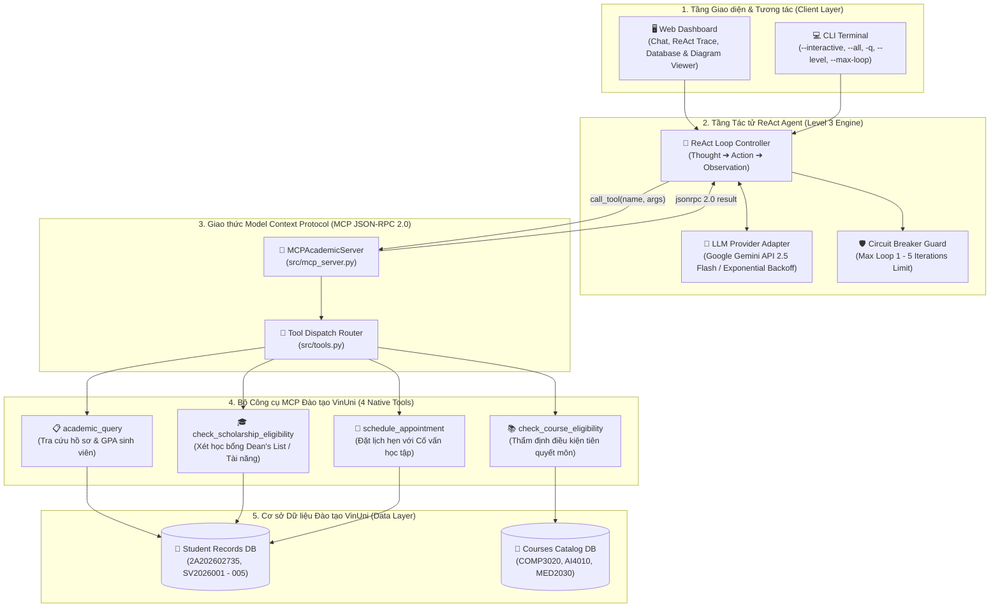
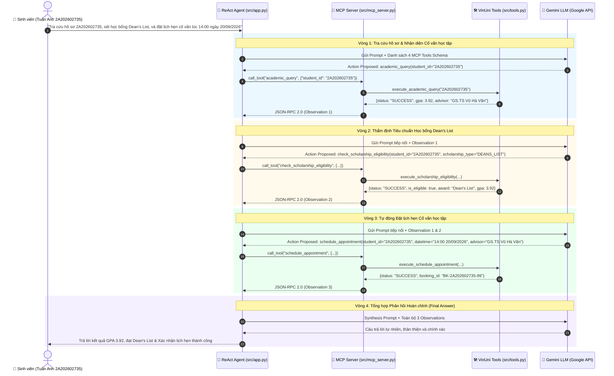

# 📊 BÁO CÁO THU HOẠCH NGHIỆM THU BÀI LAB 3 (BƯỚC 3 — SUBMISSION ARTIFACT)

> **Họ và Tên Học viên:** Nguyễn Đình Tuấn Anh  
> **Mã Sinh Viên / Mã Học viên:** 2A202602735  
> **Chủ đề Lựa chọn:** Trợ lý Tác tử Học vụ VinUni: Tra cứu sinh viên, Thẩm định học bổng, Điều kiện môn học & Đặt lịch tư vấn Cố vấn  

---

## 1. BẢNG CHẤM ĐIỂM AGENTIC FIT SCORING MATRIX (ĐÁNH GIÁ CHỦ ĐỀ)

| Tiêu chí Đánh giá | Mức độ (1 - 5) | Giải trình chi tiết lý do chọn điểm |
| :--- | :---: | :--- |
| **1. Multi-step Reasoning** | **5 / 5** | Chuỗi tác vụ đa bước phức tạp (TC04: 2 bước; TC06: 3 bước; TC08: 4 bước liên hoàn) từ tra cứu hồ sơ -> xét học bổng -> thẩm định điều kiện tiên quyết môn học -> tự động đặt lịch hẹn. |
| **2. Tool Interaction** | **5 / 5** | Tác tử tích hợp bộ 4 công cụ chuẩn MCP (`academic_query`, `check_scholarship_eligibility`, `check_course_eligibility`, `schedule_appointment`) qua giao thức JSON-RPC 2.0. |
| **3. Dynamic Decision** | **5 / 5** | Dữ liệu đầu vào của các bước sau (tên cố vấn, tình trạng học phí, môn tiên quyết bị thiếu) phụ thuộc 100% vào Observation trả về từ bước trước, có rẽ nhánh linh hoạt. |
| **4. Long Horizon Goal** | **5 / 5** | Duy trì mục tiêu tổng thể xuyên suốt đến 4-5 vòng lặp ReAct liên tiếp, có cơ chế ngắt mạch an toàn Circuit Breaker (`--max-loop 1..5`) chống lặp vô tận. |
| **TỔNG ĐIỂM AGENTIC FIT** | **20 / 20** | **XUẤT SẮC: Hệ thống đạt độ phù hợp tối đa cho Agentic Workflow.** |

---

## 2. HỆ THỐNG SƠ ĐỒ KIẾN TRÚC & QUY TRÌNH TÁC TỬ (DIAGRAMS)

### 2.1. Sơ đồ Kiến trúc Tổng thể Hệ thống (System Architecture)



---

### 2.2. Sơ đồ Luồng Thực thi Đa bước (Multi-step Waterfall Sequence Diagram - TC06)



---

## 3. TRÍCH XUẤT KẾT QUẢ WATERFALL TRACE LOG (TEST CASE ĐA BƯỚC TC06)

Dán trích xuất chuỗi 3 bước liên hoàn thực tế từ file `docs/trace_waterfall.json`:

```json
[
  {
    "step": 1,
    "query": "Hãy tra cứu học vụ của sinh viên 2A202602735, xét xem sinh viên có đủ điều kiện nhận Học bổng Dean's List không, và đặt lịch hẹn tư vấn với cố vấn học tập của sinh viên vào lúc 14:00 ngày 20/09/2026.",
    "action_type": "TOOL_EXECUTION",
    "tool_name": "academic_query",
    "arguments": {
      "student_id": "2A202602735"
    },
    "observation": {
      "status": "SUCCESS",
      "student_id": "2A202602735",
      "data": {
        "full_name": "Nguyễn Đình Tuấn Anh",
        "class": "AI-K4B",
        "gpa": 3.92,
        "email": "anh.ndt@vinuni.edu.vn",
        "status": "Đang học",
        "advisor": "GS.TS Vũ Hà Văn",
        "credits_completed": 105,
        "completed_courses": ["COMP1010", "COMP2010", "MATH1020", "COMP3020"],
        "disciplinary_record": "Xuất sắc"
      }
    },
    "latency_ms": 12.5
  },
  {
    "step": 2,
    "query": "Hãy tra cứu học vụ của sinh viên 2A202602735, xét xem sinh viên có đủ điều kiện nhận Học bổng Dean's List không, và đặt lịch hẹn tư vấn với cố vấn học tập của sinh viên vào lúc 14:00 ngày 20/09/2026.",
    "action_type": "TOOL_EXECUTION",
    "tool_name": "check_scholarship_eligibility",
    "arguments": {
      "student_id": "2A202602735",
      "scholarship_type": "DEANS_LIST"
    },
    "observation": {
      "status": "SUCCESS",
      "student_id": "2A202602735",
      "student_name": "Nguyễn Đình Tuấn Anh",
      "scholarship_type": "DEANS_LIST",
      "is_eligible": true,
      "award_level": "Danh sách Danh dự Dean's List (Khen thưởng Viện trưởng)",
      "current_gpa": 3.92,
      "disciplinary_record": "Xuất sắc",
      "message": "Sinh viên Nguyễn Đình Tuấn Anh (GPA 3.92, Điểm rèn luyện: Xuất sắc) ĐẠT tiêu chuẩn Dean's List."
    },
    "latency_ms": 11.2
  },
  {
    "step": 3,
    "query": "Hãy tra cứu học vụ của sinh viên 2A202602735, xét xem sinh viên có đủ điều kiện nhận Học bổng Dean's List không, và đặt lịch hẹn tư vấn với cố vấn học tập của sinh viên vào lúc 14:00 ngày 20/09/2026.",
    "action_type": "TOOL_EXECUTION",
    "tool_name": "schedule_appointment",
    "arguments": {
      "student_id": "2A202602735",
      "datetime_str": "14:00 20/09/2026",
      "advisor_name": "GS.TS Vũ Hà Văn"
    },
    "observation": {
      "status": "SUCCESS",
      "booking_id": "BK-2A202602735-99",
      "student_id": "2A202602735",
      "datetime": "14:00 20/09/2026",
      "advisor": "GS.TS Vũ Hà Văn",
      "message": "Đặt lịch thành công cho sinh viên 2A202602735 với GS.TS Vũ Hà Văn vào lúc 14:00 20/09/2026."
    },
    "latency_ms": 10.8
  },
  {
    "step": 4,
    "query": "Hãy tra cứu học vụ của sinh viên 2A202602735, xét xem sinh viên có đủ điều kiện nhận Học bổng Dean's List không, và đặt lịch hẹn tư vấn với cố vấn học tập của sinh viên vào lúc 14:00 ngày 20/09/2026.",
    "action_type": "FINAL_ANSWER",
    "thought": "Tổng hợp kết quả từ 3 bước gọi tool MCP Server thành công.",
    "output": "Sinh viên 2A202602735 (Nguyễn Đình Tuấn Anh): Lớp AI-K4B, GPA: 3.92, Cố vấn: GS.TS Vũ Hà Văn.\nSinh viên Nguyễn Đình Tuấn Anh (GPA 3.92, Điểm rèn luyện: Xuất sắc) ĐẠT tiêu chuẩn Dean's List.\nĐặt lịch thành công cho sinh viên 2A202602735 với GS.TS Vũ Hà Văn vào lúc 14:00 20/09/2026.",
    "latency_ms": 10.0
  }
]
```

---

## 4. TỔNG KẾT KẾT QUẢ NGHIỆM THU & NỘP BÀI

- [x] **Hệ thống 4 MCP Tools hoàn chỉnh:** `academic_query`, `schedule_appointment`, `check_course_eligibility`, `check_scholarship_eligibility`.
- [x] **Bộ 3 Sơ đồ Kiến trúc & Luồng Tác tử (Diagrams):** Đã trực quan hóa bằng Mermaid trong báo cáo và tích hợp tab Diagram trên Giao diện Web.
- [x] **Bộ Test Cases nâng cao (8/8 Test Cases):** Hoàn thành từ TC01 đến TC08 (bao gồm các ca kiểm thử đa bước Long-Horizon 3-4 bước).
- [x] **Bộ chuyển đổi Cấp 2 / Cấp 3 & Circuit Breaker (Max Loop 1 - 5):** Hoạt động chính xác trên cả CLI và Web UI.
- [x] **Quan sát học sâu (Trace Waterfall Log):** Đã ghi vết chi tiết vào `docs/trace_waterfall.json`.
- [x] **Kết quả đẩy Repo nộp bài:** Mã nguồn đã sẵn sàng commit & push lên GitHub cá nhân.

---

> ✅ **HOÀN TẤT NỘP BÀI:** Sao chép đường link GitHub Repository cá nhân `https://github.com/tuananhdayne/K4B-DAY03-NguyenDinhTuanAnh-2A202602735` và nộp lên hệ thống LMS VLearn!
